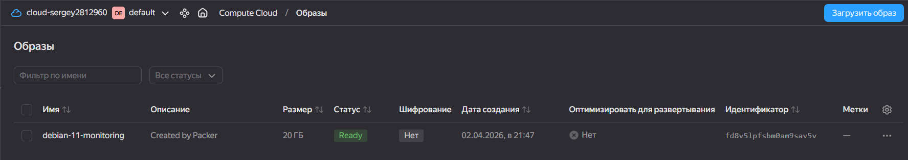
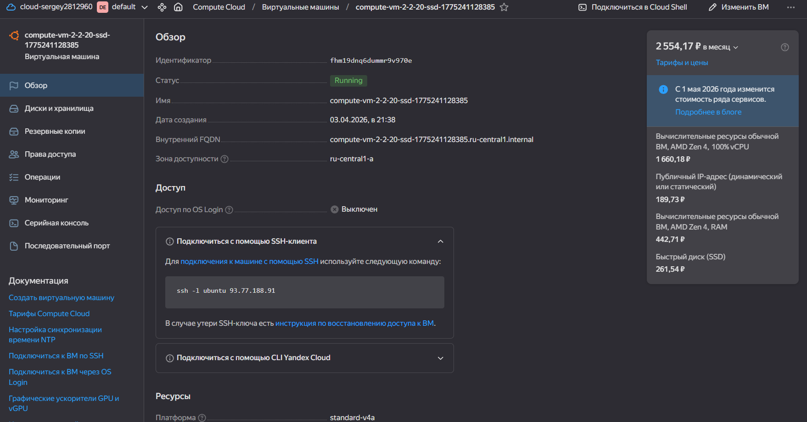
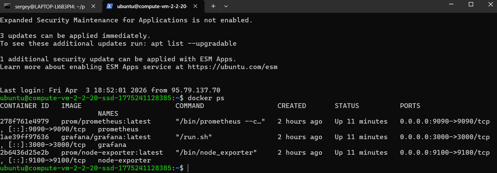
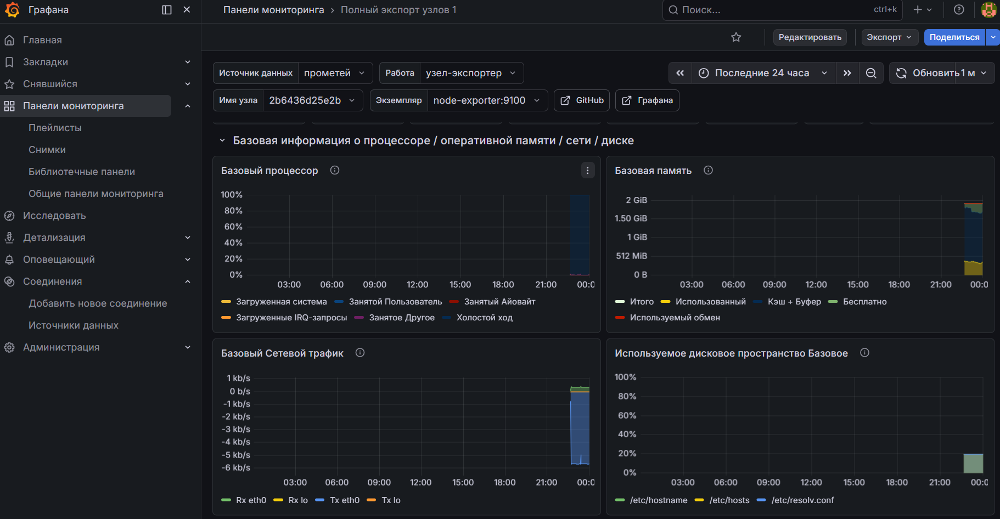

# Домашнее задание к занятию «Оркестрация группой Docker-контейнеров на примере Docker Compose»

**Выполнил:** Овсянников Сергей Алексеевич

---

## Задача 1. Packer (образ ВМ)

Создан образ `debian-11-monitoring` с Docker и Docker Compose.

---

## Задача 2. Создание ВМ

Создана ВМ с параметрами: 2 vCPU, 4 GB RAM, 20 GB диск.

---

## Задача 3. Развертывание мониторинга

Запущены контейнеры: Prometheus, Grafana, Node Exporter.

---

## Задача 4. Grafana

Grafana доступна: `http://93.77.188.91:3000` (логин/пароль: admin/admin)

---

